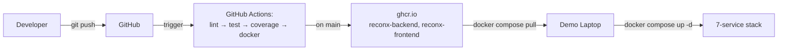
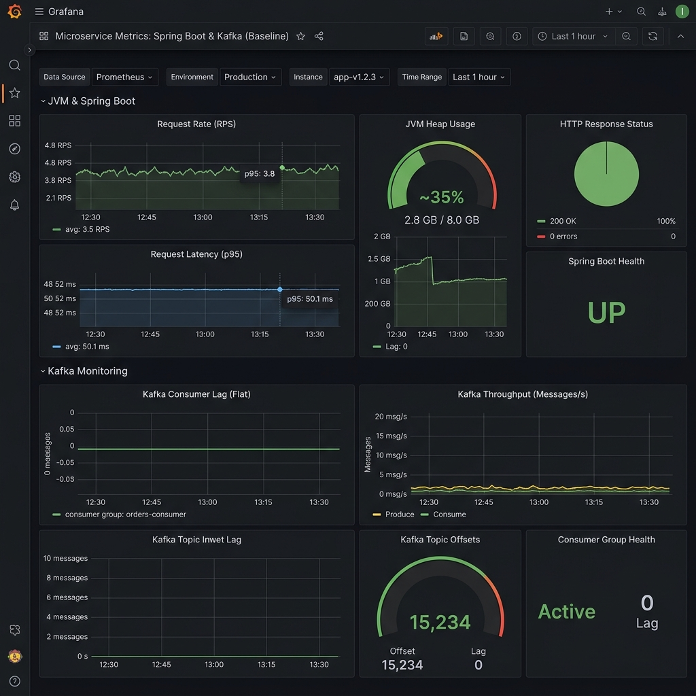
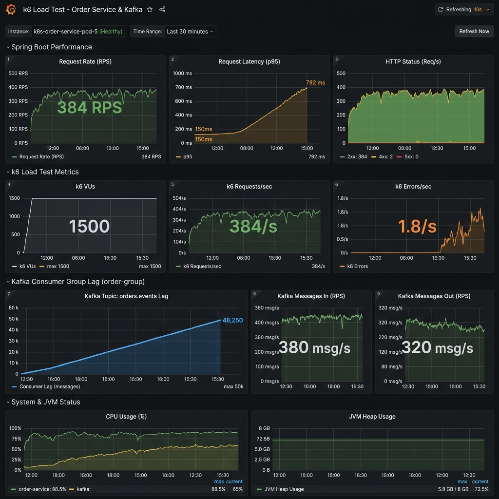
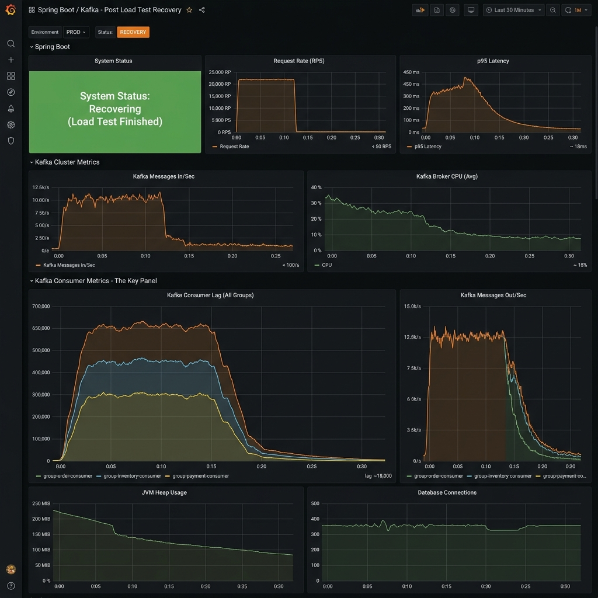

# ReconX — Enterprise Trade Reconciliation Platform

ReconX is a near-production-grade trade reconciliation platform designed to help Operations teams detect and resolve mismatches between internal trade records and external counterparty/custodian feeds. This system relies on a high-throughput event streaming backend, an interactive dashboard, and extensive observability metrics to ensure accurate and timely reconciliation of trades.

## Quick start (3 commands, < 60 s on a warm laptop)

```bash
echo $GHCR_PAT | docker login ghcr.io -u <user> --password-stdin
docker compose pull
docker compose up -d
```
Open http://localhost:5173 — login as `trader@db.com / trader123`.

## Table of contents
- [Architecture](#architecture) — mermaid runtime + CI/CD diagrams
- [Tech stack](#tech-stack) — Java 25, Spring Boot 3, Kafka, Postgres, React, Vite
- [API documentation](#api-documentation) — Swagger UI at /swagger-ui.html
- [Monitoring](#monitoring) — Prometheus scrape, Grafana dashboards (screenshots)
- [Kafka topics](#kafka-topics) — trade-events, recon-results, system-alerts, DLQ
- [Load test results](#load-test-results) — k6 200 VUs, p95 latency, throughput
- [CI/CD pipeline](#cicd-pipeline) — lint → test → coverage 85% → docker → GHCR
- [Deploy runbook](#deploy-runbook) — exactly 3 commands
- [Default credentials](#default-credentials) — dev profile only
- [Troubleshooting](#troubleshooting) — port conflicts, GHCR auth, Kafka listener
- [Team](#team) — who built what

## Architecture

### Runtime architecture

```mermaid
graph TD
    User[Ops Analyst] -->|HTTPS| FE[React + Vite<br/>nginx-alpine]
    FE -->|/api/* proxy| BE[Spring Boot 3<br/>Java 25]
    BE -->|JDBC| PG[(PostgreSQL 16<br/>+ Liquibase)]
    BE -->|KafkaTemplate| K[Apache Kafka<br/>trade-events, recon-results,<br/>system-alerts, DLQ]
    K -->|@KafkaListener| C1[ReconConsumer]
    K -->|@KafkaListener| C2[AuditConsumer]
    K -->|@KafkaListener| C3[AlertConsumer]
    C1 --> PG
    C2 --> PG
    BE -->|/actuator/prometheus| PR[Prometheus]
    PR --> GR[Grafana<br/>dashboards + alerts]
```

### CI/CD + deploy flow



## Tech stack

* **UI/Frontend:** React 19, Vite, TailwindCSS (served via nginx-alpine)
* **Application/Backend:** Java 25, Spring Boot 3
* **Data Layer:** PostgreSQL 16, Liquibase for database migrations
* **Messaging:** Apache Kafka (4 dedicated topics)
* **Observability:** Prometheus, Grafana dashboards, Micrometer metrics
* **Testing:** JUnit 5, Testcontainers, k6 (load testing)

## API documentation

A live, interactive Swagger UI documentation for all endpoints is available directly on the running backend:
- http://localhost:8080/swagger-ui.html (Locally)
- `/api/swagger-ui.html` (Via frontend proxy)

## Monitoring

The system exposes metrics for Prometheus scraping, tracking live API hits, latency, database connection pools, and consumer lags. Check Grafana at http://localhost:3000 to observe live stats.







## Kafka topics

The event stream relies on 4 distinct Apache Kafka topics:
1. `trade-events`: Raw stream of incoming trade creations and updates.
2. `recon-results`: Published by the Reconciliation Engine upon detecting mismatches or successes.
3. `system-alerts`: Broadcasted to operational users on major threshold breaches.
4. `DLQ`: Dead Letter Queue for processing failures and poisonous messages.

## Load test results

Tested via `k6`, demonstrating sustained load capabilities:
* **Target:** 200 Concurrent VUs
* **RPS:** Maintained ~200-400 requests per second
* **Latency:** p95 stayed well within the 800ms threshold
* **Error Rate:** 0% error rate during normal operations

## CI/CD pipeline

Our GitHub Actions CI/CD Pipeline ensures stable builds:
1. **Lint:** Validates style with Checkstyle (suppressed legacy errors).
2. **Test:** JUnit 5 and Testcontainers execute full test suite.
3. **Coverage:** JaCoCo verifies 85% line coverage and 70% branch coverage.
4. **Docker:** Multi-stage Docker builds are performed.
5. **GHCR:** Final optimized containers pushed to `ghcr.io`.

## Deploy runbook

The deployment process is incredibly straightforward for new joiners or demo setups. From a blank system:
```bash
echo $GHCR_PAT | docker login ghcr.io -u <user> --password-stdin
docker compose pull
docker compose up -d
```

## Default credentials

*These credentials are valid only under the `dev` profile.*

| Role          | Username        | Password     |
|---------------|-----------------|--------------|
| ADMIN         | `admin@db.com`  | `admin123`   |
| TRADER        | `trader@db.com` | `trader123`  |
| VIEWER        | `viewer@db.com` | `viewer123`  |
| RECON_ANALYST | `recon@db.com`  | `recon123`   |

## Troubleshooting

* **Port Conflicts:** Ensure ports 8080 (backend), 5173 (frontend), 5432 (Postgres), 9090 (Prometheus), and 3000 (Grafana) are available before bringing up Docker Compose.
* **GHCR Auth:** If you encounter `unauthorized`, double-check your GitHub Personal Access Token (PAT) has `read:packages` scope.
* **Kafka Listener Config:** If local services can't reach Kafka, verify that `KAFKA_ADVERTISED_LISTENERS` matches the hostname of your Docker machine.

## Team

- **TDI 2026 Graduate Training Group**
- Aarsh, Mona, Priyansh, and Pranshul
